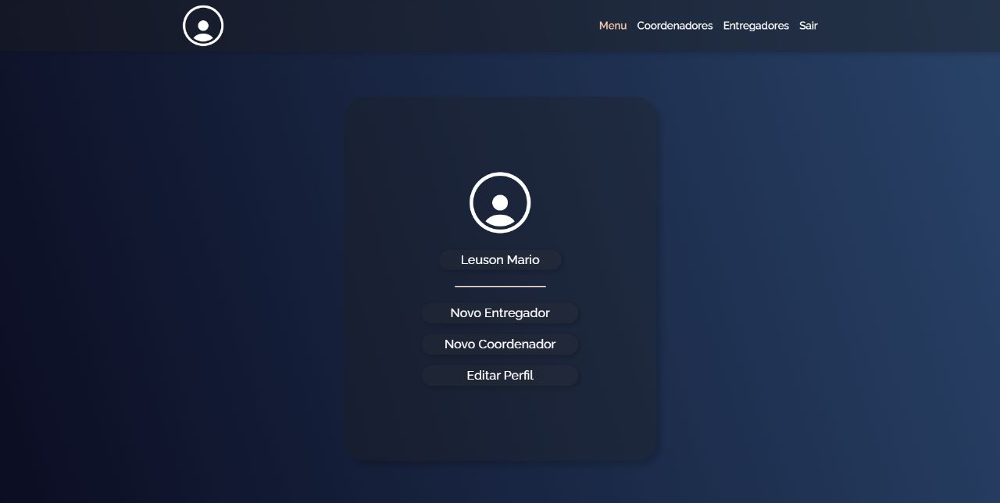

<h1 align="center">Charlotte-Project</h1>

<h3 align="center">Projeto desenvolvido em Equipe para a cadeira de Engenharia de Software do 5° período da faculdade.</h3>

  <a href="#-página-de-login">Login</a>&nbsp;&nbsp;&nbsp;|&nbsp;&nbsp;&nbsp;
  <a href="#-página-de-registro">Resgistro</a>&nbsp;&nbsp;&nbsp;|&nbsp;&nbsp;&nbsp;
  <a href="#-área-do-administrador">Administrador</a>&nbsp;&nbsp;&nbsp;|&nbsp;&nbsp;&nbsp;
  <a href="#-projeto">Projeto</a>&nbsp;&nbsp;&nbsp;|&nbsp;&nbsp;&nbsp;
  <a href="#%EF%B8%8F-tecnologias">Tecnologias</a>&nbsp;&nbsp;&nbsp;|&nbsp;&nbsp;&nbsp;
  

 

## 📷 Página de Login

  

 

## 📷 Área do Administrador

  

 

## 💻 Projeto

Projeto de gerenciamento de entregadores com o intuito de ajudar na dificuldade em realizar os cálculos dos pagamentos dos entregadores, e a falta de agilidade na geração de relatórios. Automatizando a etapa de calcular e atualizar os dados dos entregadores.

 

## 🖥️ Tecnologias

  O projeto foi realizado com as seguintes tecnologia:

  - PHP
  - HTML 
  - CSS
  - JAVA
  
 

## 👷 Colaboradores

#### Nome: Danilo Jean da Silva
- GitHub: [gigazin](https://github.com/gigazin)

#### Nome: Flávio Vínicius da Silva Santos
- GitHub: [FVSSANTOS](https://github.com/FVSSANTOS)

#### Nome: Lucas Antonio Miranda de Andrade
- GitHub: [LucasAntonio20](https://github.com/LucasAntonio20)

#### Nome: Luiz Fernando Leite
- GitHub: [LuizFernando-o](https://github.com/LuizFernando-o)

#### Nome: Luiz Fernando Soares Ximenes Accioly
- GitHub: [Nandincci](https://github.com/Nandincci)

#### Nome: Wallison Willian de Oliveira Melo
- GitHub: [WallisonWilliam](https://github.com/WallisonWilliam)

 
